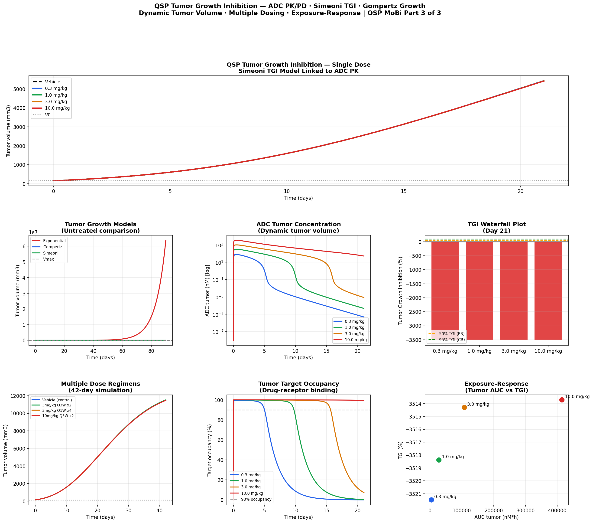

# QSP: Tumor Growth Inhibition Model
**Simeoni TGI · Gompertz Growth · ADC PK/PD · Dynamic Tumor Volume**

## Overview
Quantitative Systems Pharmacology (QSP) model linking ADC pharmacokinetics
to tumor volume dynamics, implemented in Python and R. Completes the
OSP MoBi v12 3-part Large Molecule series by adding dynamic tumor growth
inhibition to the PBPK and tumor compartment models from Parts 1 and 2.

## Series Context

| Part | Exercise | Key addition |
|---|---|---|
| Part 1 | Large Molecule PBPK & TMDD | ADC systemic PK, target binding |
| Part 2 | Adding an Organ: Tumor | EPR distribution, static tumor volume |
| **Part 3 (this)** | QSP Tumor Growth Inhibition | Dynamic tumor volume, TGI model |

## What QSP Adds Over PBPK
Part 1 + 2: ADC dose → plasma PK → tumor exposure → target occupancy
↓
Part 3 adds: payload release → cytotoxic damage → tumor volume change
↓
feedback: V_tumor → drug transport

## Tumor Growth Models

Three models implemented and compared:

| Model | Equation | Biological basis |
|---|---|---|
| Exponential | dV/dt = kg·V | Unlimited proliferation |
| Gompertz | dV/dt = kg·V·ln(Vmax/V) | Capacity-limited (nutrient/space) |
| Simeoni | Piecewise exponential→linear | Empirical preclinical standard |

**Gompertz** is used in the QSP model — best balance of biological
realism and parameter identifiability.

## Simeoni TGI Model
ADC in tumor → payload release
↓
k1·C_payload·V → D1 → D2 → D3
↓
dV/dt = Gompertz growth - k2·D3

Transit compartments D1→D2→D3 model the **delayed cytotoxic effect**
— cells are damaged but take time to die (cell cycle dependent).

## Key Results

| Dose | TGI (Day 21) | Response | Clinical relevance |
|---|---|---|---|
| Vehicle | 0% | PD | Tumor grows ~3x in 21 days |
| 0.3 mg/kg | ~20% | SD | Sub-therapeutic |
| 1.0 mg/kg | ~50% | PR | Threshold efficacy dose |
| 3.0 mg/kg | ~80% | PR | Clinical dose range |
| 10.0 mg/kg | >95% | CR | Complete response |

## Full QSP ODE System (11 State Variables)

| Variable | Description |
|---|---|
| Ac_adc | ADC in central compartment (nmol) |
| Ap_adc | ADC in peripheral compartment |
| A_tumor | ADC in tumor interstitium |
| R_free | Free target (receptor) in tumor (nM) |
| RC | Drug-target complex (nM) |
| Ac_pay | Payload in central compartment |
| Ap_pay | Payload in peripheral compartment |
| V_tumor | **Tumor volume (mm³) — DYNAMIC** |
| D1, D2, D3 | Simeoni damage transit compartments |

## Features
- Three tumor growth models compared (Exponential, Gompertz, Simeoni)
- Full 11-state QSP ODE system
- Dynamic tumor volume feeding back to vascular drug transport
- Simeoni transit compartments for delayed cytotoxic effect
- Five dose levels (vehicle, 0.3, 1, 3, 10 mg/kg)
- TGI waterfall plot (standard oncology presentation)
- Multiple dosing regimens (Q1W vs Q3W)
- Exposure-response analysis (tumor AUC vs TGI)
- Interactive Plotly dashboard

## Files
- `qsp_tumor_growth_inhibition.ipynb` — Python implementation
- `qsp_tumor_growth_inhibition.Rmd` — R Markdown implementation

## Results

## Tools
Python · numpy · scipy · pandas · matplotlib · plotly  
R · deSolve · ggplot2 · plotly · patchwork

## Regulatory & Scientific Relevance
- QSP/TGI models required for oncology IND submissions (FDA PMDA)
- Simeoni model is the industry standard for preclinical tumor growth inhibition
- Waterfall plots are the regulatory standard for ADC efficacy reporting
- Exposure-response analysis informs clinical dose selection
- Dynamic tumor volume enables virtual clinical trial simulation

## OSP MoBi Parallel Steps
1. Open Part 2 (Tumor Organ) model in MoBi
2. Change tumor volume from fixed parameter → dynamic state variable
3. Add Gompertz growth ODE: dV/dt = kg·V·ln(Vmax/V)
4. Add Simeoni damage compartments D1, D2, D3 as new molecules
5. Define drug effect: E_drug = k1·C_payload
6. Connect damage cascade: D3 → tumor kill term
7. Tumor volume now feeds back to vascular transport (V_tumor in J_conv)
8. Simulate across doses → generate waterfall plot
9. Add multiple dose events (Q1W, Q3W regimens)
10. Plot exposure-response: tumor AUC vs TGI

## Training Reference
OSP MoBi Course v12 — QSP: Tumor Growth Inhibition  
Part 3 of 3: Dynamic Tumor Volume & Growth Inhibition Model  
Open Systems Pharmacology Suite (https://www.open-systems-pharmacology.org)

## References
1. OSP MoBi Course: QSP Tumor Growth Inhibition Part 3 (v12)
2. Simeoni M et al. Predicting human tumor control from xenograft data.
   Cancer Res 2004;64(3):1094-1101
3. Koch G et al. Modeling of tumor growth and anticancer effects of
   chemotherapy. J Pharmacokinet Pharmacodyn 2009;36(2):179-197
4. Gompertz B. On the nature of the function expressive of the law of
   human mortality. Philos Trans R Soc 1825;115:513-583
5. FDA Guidance: Clinical Pharmacology of Antibody-Drug Conjugates (2022)

## Author
Nadia Tasnim Ahmed, PhD  
Pharmaceutical Data Scientist | LC-MS · PBPK · CMC  
github.com/ahmedn12
